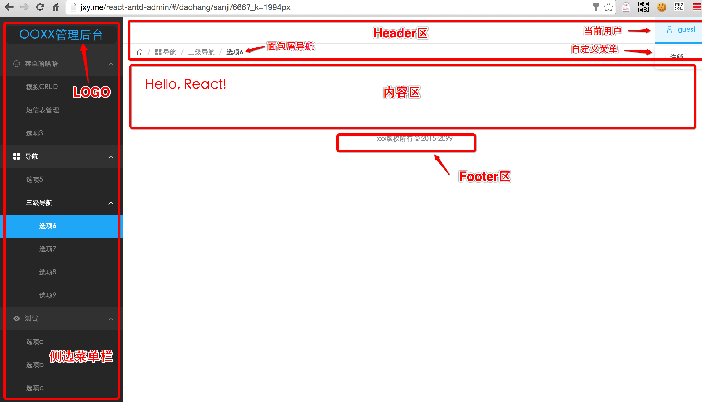
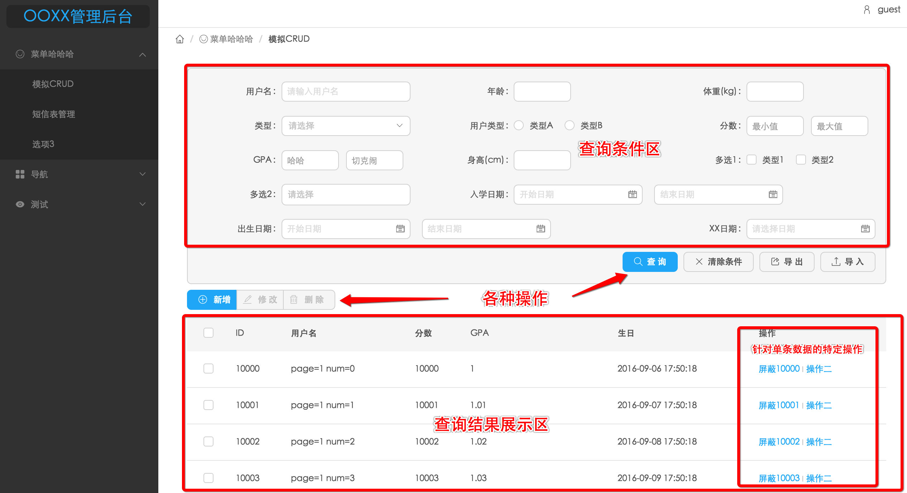

# React通用后台

目标是快速搭建一个可用的后台界面，可以先看下[DEMO(普通)](http://jiangxy.github.io/react-antd-admin) / [DEMO(TAB模式)](http://jiangxy.github.io/react-antd-admin/tabMode)，用户名/密码：guest/guest。友情提示：这个DEMO还是有点大的，加载可能稍慢，注意网速。。。

也可以[点击这里](docs/Screenshot.md)查看截图，包含一些主要特性的演示。

如果对React或Ant Design感兴趣，但又不知如何入手的话，也可以参考下这个项目。
 
* [这是个啥东西](#需求背景)
* [Quick Start](#quick-start)
* [更新记录](CHANGELOG.md)
* [TODO](docs/TODO.md)
* [一些说明](#一些说明)
* [更多文档](docs/README.md)

## 需求背景

其实总结下就一句话：简化后端人员的前端开发。。。

虽然俺是个java开发，但总是难免要做一些前端的东西。比如各种内部系统，各种运营后台，总要有个界面给人用的吧。如果是自己用的话当然命令行就可以将就下了。。。

内部系统么，公司也不会很重视，不会有专业的前端来搞。后端人员自己搞搞，能用就行了。

然而每次写前端都很痛苦，无论以前用velocity+jquery+bootstrap，还是现在用React。首先有很多重复的工作，很多后台界面其实都长得差不多；其次有时会为一些很小的需求投入很大精力，写很多业务逻辑，但这些代码都是不可复用的，感觉花这么多时间不值得，毕竟不是本职工作啊，只是个二手前端。。。甚至有时折腾css就能搞一天。。。

于是就想着能否一劳永逸，搞个比较通用的东西出来，**尽量用写配置的方式替代写代码**。从某种角度上说，和[Metronic](http://keenthemes.com/preview/metronic/)/[AdminLTE](https://almsaeedstudio.com/preview)的目标有点相似。正好前段时间在研究[Ant Design](http://ant.design)，做了一些尝试，于是有了这个项目。当然并不完美，对于React和Ant Design，我也是边学边用的。

首先看下，常见的后台系统都是什么样子的？

是不是大部分后端系统的界面都差不多这个样子？分为几个主要的部分：

* 侧边栏：上面是一个logo，下面是可展开的各级菜单。点击菜单项时，右边会展示相应的内容。
* Header：展示当前登录的用户名和面包屑导航，还可能有自定义的一些菜单之类
* 内容区：展示具体的内容，跟业务有关的
* Footer：展示copyright之类的
* 还有些看不到的，比如登录、注销等

于是我做的**第一件事**，就是搭建一个框架，用配置文件的方式，生成这样一个界面。你可以定义自己的侧边栏（参考[src/menu.js](src/menu.js)），定义点击侧边栏菜单时在右边渲染什么组件（参考[src/index.js](src/index.js)，其实就是React Router的配置），包括header/footer/登录校验/单点登录等，都可以配置（参考[src/config.js](src/config.js)）。

在此基础上，我只要根据不同的后台系统的业务逻辑，去写不同的React组件，再配置下菜单就可以了。貌似简化很多了。缺点就是所有后台都长一个样子。。。

但能否更简化些呢？在各种运营后台中，最常见的操作是什么？我的感觉，最常见的就是各种数据库表的CRUD。我们经常赋予数据库字段各种业务意义。比如将某条记录的status字段改为-1，表示屏蔽这个商品；或者新增一个商品，其实就是某个表新增一条记录之类的。运营的很多操作，是不是都能简化成CRUD？于是我又做了**第二件事**：写了一个通用的CRUD组件，我称之为DBTable。大概长这个样子：

也是分为几个部分：

* 查询条件区：其实就是个表单，所有表单项都是由配置文件生成的（参考[src/schema/test.querySchema.js](src/schema/test.querySchema.js)），支持各种数据类型
* 各种操作：提供常用的CRUD/导入/导出等操作
* 查询结果展示：就是一个表格，这个表格的schema也是可配置的（参考[src/schema/test.dataSchema.js](src/schema/test.dataSchema.js)）
* 针对单条数据的操作：也是可配置的（参考[src/schema/testAction.dataSchema.js](src/schema/testAction.dataSchema.js#L52)）

另外提醒下，1.4.0版本之后，querySchema和dataSchema不一定要用js文件配置了，可以从服务端异步加载了，参考[异步schema相关配置](docs/AsyncSchema.md)。

使用者只用关心自己的schema文件就可以了，不用在意渲染出来是什么样子。利用DBTable组件，就可以快速实现对某个表的CRUD了（其实不只可以用于数据库，符合这种操作模式的都可以用）。缺点就是没有了明确的业务含义，运营MM们可能不会用。。。她们又不知道CRUD是啥。所以需要培训下，但也是套近乎的好机会啊😄。

但是且慢，只有界面是不够的，**如何跟后端对接**？于是我又定义了[后端接口格式](docs/Ajax.md)。只要按这个格式去写后端接口，就可以跟这套通用后台无缝对接。如果你跟我一样是个懒人，而且恰巧是用java的，又恰巧后端是基于Spring的，那也可以使用我提供的一个[小工具](https://github.com/jiangxy/react-java-goos)直接生成后端接口，然后填写自己的业务逻辑就可以了。

使用这套工具，如果一切顺利的话，你能很快的搭出一个后台界面，包含基础的登录/菜单/导航/CRUD/导入/导出等功能，并且界面&体验也还算看得过去，不用任何编码，只是修改配置。

我尽量做到**配置优于代码**，尽量少写代码。但完全不写代码是不可能的，尤其是有个性化需求时，这就要自己权衡了。这套工具比较适合项目初期做个原型、或者对后台要求不高的情况。

## Quick Start

在自己的机器上调试：

1. 保证node版本5.3+，npm版本3.3+
2. clone下来后，`npm install`，安装必要的依赖
3. `npm run dev`，启动webpack-dev-server，打开浏览器`http://localhost:8080`查看效果。默认是debug模式，不会请求后端接口，所有数据都是mock的，相关配置见[src/config.js](src/config.js)
4. 如果有必要的话可以把logLevel设置为debug（见[src/config.js](src/config.js)），会输出详细的debug日志，打开chrome的console就可以看到。

用在自己的项目中：

1. 保证node版本5.3+，npm版本3.3+
2. clone下来后，`npm install`，安装必要的依赖
3. 参考[src/menu.js](src/menu.js)，按自己的需要配置侧边栏和顶部菜单
4. 修改[src/index.js](src/index.js)中的路由表，保证和menu.js中的菜单项一致，否则可能404
5. 如果要用DBTable组件的话，参考[src/schema](src/schema)下的例子，编写自己的querySchema和dataSchema文件。在路由表中配置DBTable组件时，要把表名作为props传入，类似`<Route path="option1" tableName="test" component={DBTable}/>`。
6. 修改[src/config.js](src/config.js)中相关配置，比如项目名、footer、单点登录等等。
7. `npm run prod`，编译js文件，然后将dist目录下的所有js/css/html文件拷贝到自己的工程中，前端的工作就完成了。一般会有一个index.html，一个bundle.min.css，以及多个js文件，跟是否使用动态路由有关。
8. 开发后端接口，接口规范见[这里](docs/Ajax.md)。如果是java后端，可以使用[这个工具](https://github.com/jiangxy/react-java-goos)帮你生成。
9. 启动你的web服务，访问`index.html`查看效果。

其他一些命令:

1. `npm run eslint`/`npm run stylelint`/`npm run lesshint`，一些lint工具。
2. `npm run clean`，删除dist目录下的bundle*.js。

## 一些说明

### 安全/权限问题

目前对安全&权限都没考虑进去，如果有这方面的要求，只能后端校验了。在请求后端接口时校验用户的身份和权限。

权限问题也很麻烦，感觉不太好做成通用的东西，如果有需求的话，还是定制开发比较好。
 
### 兼容性

能力所限，只能保证chrome中正常使用。。。话说在各种内部系统中，要求只能用chrome也挺常见吧。

如果我解决了兼容性问题，就不是二手前端了。。。

另外由于我是在mac下进行开发的，所以对windows下的情况测试的比较少，有问题欢迎提issue，我尽力解决。

### bundle size

单页应用的首屏渲染一直都是个大问题。webpack打包出来的bundle.js一般都很大，虽然我想了很多办法去优化，但总是还会有1M多，实在减不下去了。。。所以应用到外网时要小心，初次加载时可能比较慢。

内网的话就无所谓了，一般网速都不是问题。
